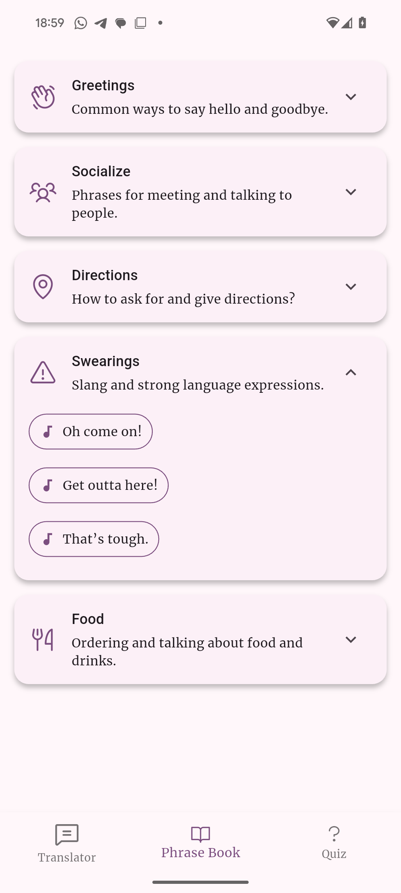

# flutter_meetup_16_08_2025

An example Flutter app built for a meetup: a small Vienna dialect trainer featuring a phrase book, an audio quiz, and a speech translator.

## Highlights
- Phrase Book by categories with tap-to-play audio
- Audio Quiz with randomized answers
- Translator page with speech-to-text and text-to-speech
- Robust networking layer (Dio) with centralized error handling
- Riverpod for state management
- Mock data from bundled JSON assets to speed up development

## Screenshots

### Game


### Phrase Book


### Translator


### Translator (initial)


## Getting Started

Prerequisites:
- Flutter (latest stable)
- A device or simulator/emulator set up

Install dependencies and run:

```bash
flutter pub get
flutter run
```

## Tech Stack
- Flutter + Dart
- State: Riverpod
- Navigation: auto_route
- HTTP: Dio
- Audio: just_audio and flutter_tts

## Data & Audio
- This is referenced in:
  - `lib/providers/game_provider.dart` (quiz playback)
  - `lib/pages/phrase_book_screen.dart` (phrase book playback)

To change the audio host, update the base URL in those files.

## Notes
- iOS/Android microphone and network permissions are configured for speech and audio playback.
- The app falls back to TTS for entries using the `tts:` scheme.
